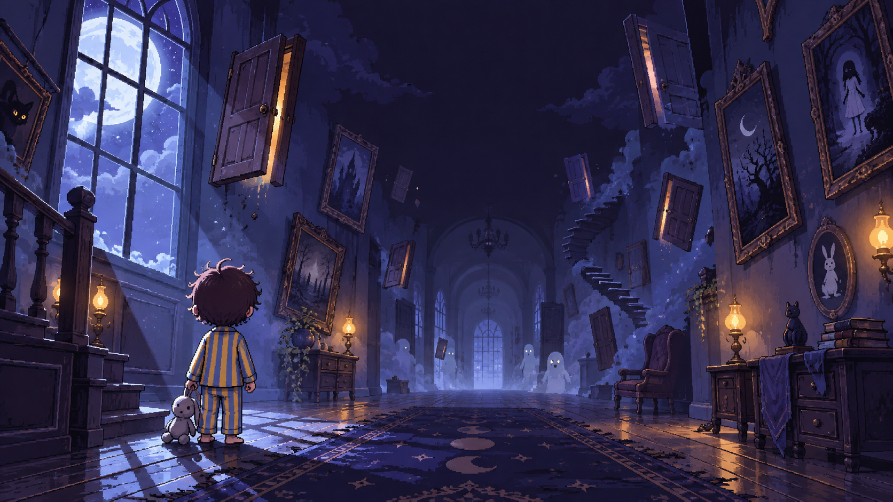
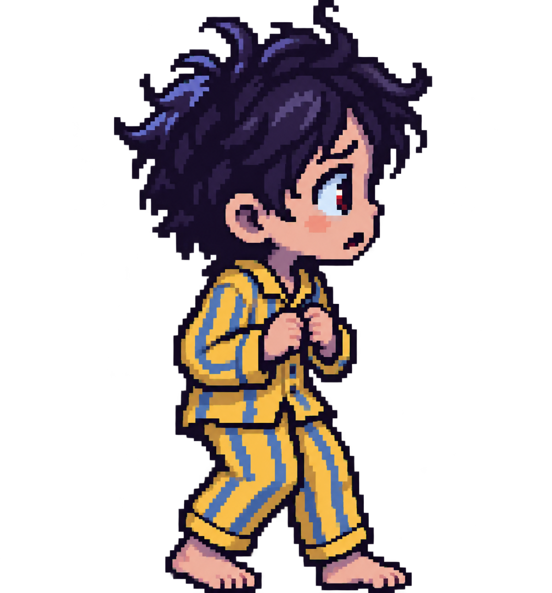
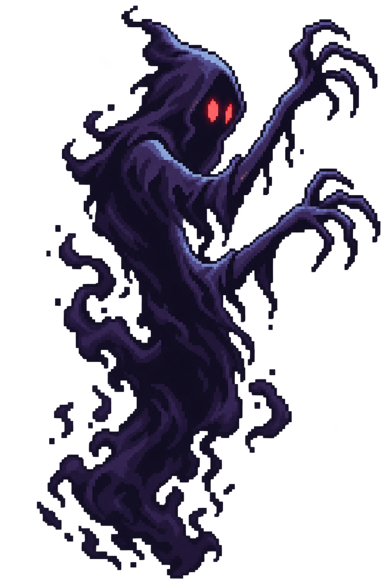
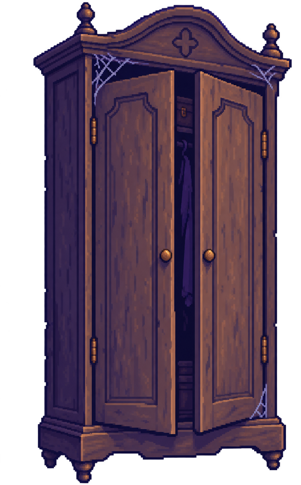
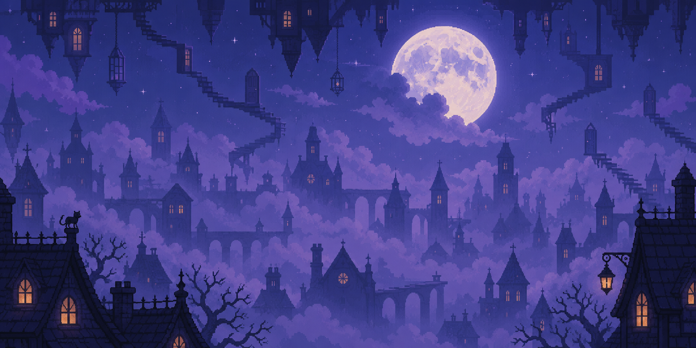

<div align="center">
  

  <p><em>Sebuah mimpi buruk tentang rumah, rasa takut, dan jalan pulang menuju sesuatu yang paling berharga.</em></p>

  
</div>

## Ketika rumah tidak lagi terasa seperti rumah

LELAP adalah game platformer dua dimensi dengan tampilan samping dan gaya pixel art. Ceritanya mengikuti seorang anak kecil yang terperangkap di dalam mimpi. Rumah yang ia kenal telah berubah menjadi lorong gelap yang mustahil, dipenuhi bayangan hidup, hantu, perabot tua, dan cahaya bulan yang terasa dingin.

Di dalam mimpi ini tidak ada senjata dan tidak ada perlawanan. Sang anak hanya dapat berjalan, berlari, melompat, bersembunyi, dan mencari tempat yang masih diterangi cahaya. Ia harus menemukan tiga boneka beruang agar portal keluar dari mimpi buruk muncul.

<div align="center">
  
  &nbsp;&nbsp;&nbsp;
  
  &nbsp;&nbsp;&nbsp;
  
</div>

## Mimpi Buruk

Pengembangan LELAP saat ini berfokus pada Level 1 yang berjudul **Mimpi Buruk**. Level ini membawa pemain menyusuri rumah yang berubah menjadi dunia ganjil dan menyeramkan. Setiap bagian dirancang untuk mengenalkan ancaman baru secara alami, mulai dari lorong yang relatif aman, tempat persembunyian, jurang dan pijakan, hingga pertemuan terakhir yang menggabungkan beberapa bahaya sekaligus.

Perjalanan ini bukan tentang mengalahkan musuh. Ketegangan datang dari membaca keadaan, mengenali perilaku setiap hantu, dan memilih kapan harus bergerak atau menunggu. Cahaya lampu tidur menjadi ruang aman. Lemari menjadi tempat untuk menahan napas. Berlari dapat menyelamatkan, tetapi suara langkah juga dapat mengundang bahaya.

## Penghuni di dalam mimpi

<table>
  <tr>
    <td align="center" width="33%">
      <br>
      <strong>Pengembara</strong>
    </td>
    <td align="center" width="33%">
      <br>
      <strong>Pengintai</strong>
    </td>
    <td align="center" width="33%">
      <br>
      <strong>Bayangan</strong>
    </td>
  </tr>
  <tr>
    <td valign="top">Hantu seprai yang berpatroli di sepanjang lorong. Ia dapat melihat anak dari kejauhan dan mendengar langkah kaki yang berisik. Saat kehilangan jejak, ia akan kembali mengembara.</td>
    <td valign="top">Sosok pucat menyerupai boneka tua. Ia hanya bergerak ketika tidak dilihat dan langsung membeku saat tatapan pemain kembali mengarah kepadanya.</td>
    <td valign="top">Makhluk gelap yang bersembunyi di lantai. Ia memberi peringatan singkat sebelum menjulang dan menyerang, sehingga pemain harus memahami waktu yang tepat untuk lewat.</td>
  </tr>
</table>

Ketiganya mengikuti aturan yang sama terhadap cahaya. Tidak ada hantu yang dapat memasuki lingkaran hangat dari lampu tidur. Namun, rasa aman itu hanya bertahan selama pemain berada cukup dekat dengan sumbernya.

## Bertahan tanpa melawan

<table>
  <tr>
    <th>Gerakan</th>
    <th>Makna di dalam permainan</th>
  </tr>
  <tr>
    <td>Berjalan</td>
    <td>Pelan dan lebih sunyi, cocok untuk melewati area yang sedang diawasi.</td>
  </tr>
  <tr>
    <td>Berlari</td>
    <td>Cepat tetapi berisik dan menguras stamina. Ketika stamina habis, anak harus kembali berjalan sampai tenaganya pulih.</td>
  </tr>
  <tr>
    <td>Melompat</td>
    <td>Digunakan untuk menyeberangi jurang serta mencapai rak, meja, buku, dan kotak yang menjadi pijakan.</td>
  </tr>
  <tr>
    <td>Bersembunyi</td>
    <td>Lemari dapat memutus pandangan hantu, selama pemain tidak terlambat masuk ketika pengejar sudah terlalu dekat.</td>
  </tr>
  <tr>
    <td>Berlindung</td>
    <td>Cahaya hangat lampu tidur menciptakan zona aman yang tidak dapat ditembus hantu.</td>
  </tr>
</table>

<div align="center">
  
  &nbsp;&nbsp;&nbsp;&nbsp;
  
</div>

## Kontrol

| Tombol | Aksi |
|:---:|:---|
| `A` `D` atau `←` `→` | Bergerak |
| `Shift` | Berlari |
| `Space` atau `W` | Melompat |
| `S` | Bersembunyi di dalam lemari |
| `P` | Menjeda permainan |
| `F` | Mengaktifkan atau menonaktifkan layar penuh |

## Menjalankan proyek

Proyek membutuhkan Node.js dan npm. Setelah repository tersedia secara lokal:

```bash
npm install
npm run assets
npm run dev
```

`npm run assets` memproses sumber gambar dari `assets-src/` ke `public/` dan
memperbarui manifest. Untuk membuat versi production:

```bash
npm run build
npm run preview
```

Hasil build production berada di folder `dist/`.

## Dunia yang bergerak seperti mimpi

Visual LELAP menggunakan pixel art dengan warna malam berupa indigo, ungu berdebu, dan biru cahaya bulan. Warna kuning pada piyama anak serta cahaya jingga dari lampu menjadi penunjuk visual di tengah lingkungan yang gelap. Suasananya menyeramkan tanpa kekerasan grafis, sehingga rasa takut lahir dari siluet, ruang kosong, gerakan, dan sesuatu yang mungkin bersembunyi di luar cahaya.

Latar permainan tersusun atas tiga lapisan parallax. Pemandangan jauh, dinding lorong, dan benda di bagian depan bergerak dengan kecepatan berbeda untuk membuat rumah terasa luas sekaligus tidak nyata.

<div align="center">
  
</div>

## Fondasi proyek

LELAP ditujukan untuk browser desktop dan dibangun dengan **KAPLAY**, **Vite**, serta JavaScript biasa. Dunia permainan memakai sistem tile berukuran 64 unit, tinggi pandangan yang konsisten, dan pemuatan aset melalui manifest. Susunan kode dirancang agar mimpi baru dapat ditambahkan pada masa mendatang tanpa merombak fondasi Level 1.

Seluruh angka yang memengaruhi rasa permainan ditempatkan dalam konfigurasi terpusat. Level ditulis sebagai peta berbasis simbol, sementara karakter, hantu, pencahayaan, kamera, latar parallax, dan antarmuka dipisahkan berdasarkan tanggung jawabnya. Jika sebuah aset belum tersedia, permainan tetap dapat berjalan dengan visual pengganti agar proses pengembangan tidak terhenti.

## Arah pengembangan

Fokus proyek saat ini sepenuhnya berada pada penyelesaian **Mimpi Buruk** sebagai pengalaman singkat yang utuh. Tujuannya adalah menghadirkan perjalanan sekitar dua menit yang tetap terasa tegang, mudah dipahami, dan adil. Setiap ancaman harus memberi tanda sebelum menyerang, setiap kegagalan harus dapat dipelajari, dan perjalanan mengumpulkan tiga boneka menuju portal harus terasa seperti keberanian kecil di tengah mimpi yang besar.

<div align="center">
  

  <p><strong>Temukan ketiga boneka. Buka jalan keluar dari mimpi buruk.</strong></p>
</div>
